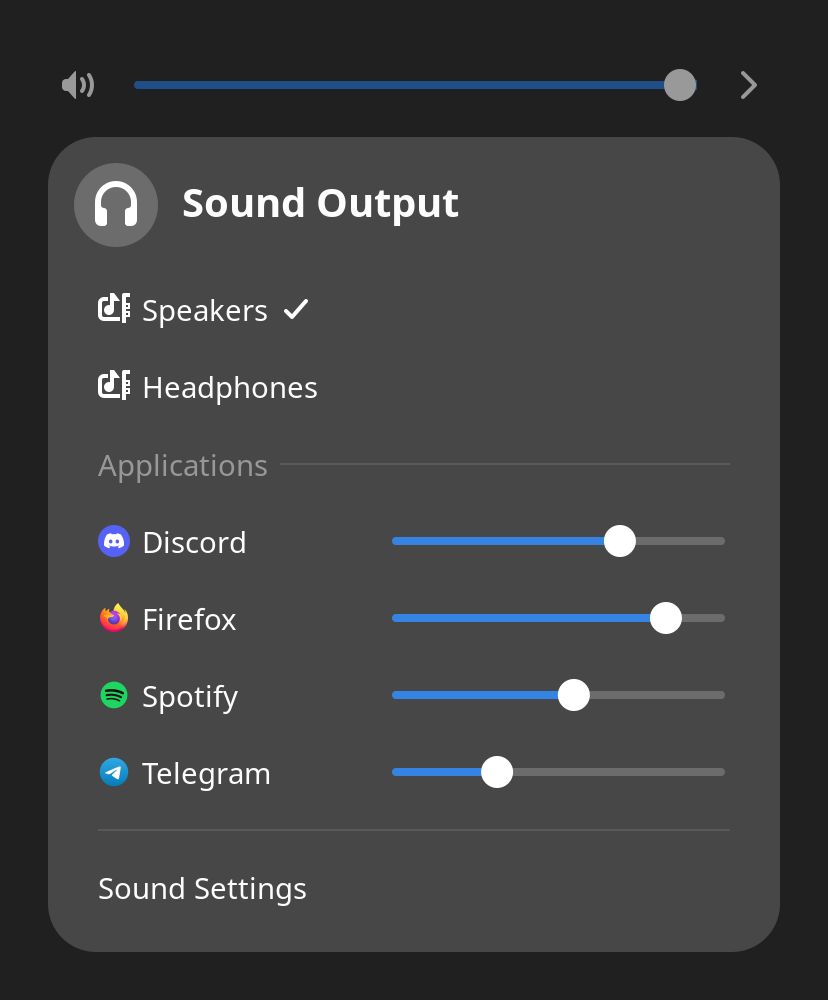

# App Volumes

A GNOME Shell extension that adds per-application volume sliders to Quick
Settings — including applications that are running but silent right now,
much like the Windows volume mixer.



Discord and Telegram are silent in this screenshot; Firefox and Spotify are
playing.

## Why

GNOME Settings, the Quick Settings menu and pavucontrol list an application
only while it is playing sound. Many apps open an audio stream just for the
moment a sound plays: Telegram, for example, shows up only while a
notification is ringing, so there is no way to turn its notifications down
in advance.

PipeWire's session manager, WirePlumber, already remembers a volume for every
application and restores it whenever the app starts a new stream. App Volumes
lets you set that volume at any time.

## Features

- A slider for every application that is connected to PipeWire and has
  played sound before, plus everything that is playing right now. Apps
  minimized to the tray are included.
- Moving a slider changes the app's streams that are playing and the volume
  WirePlumber will use for its next stream, such as the next notification.
- The sliders sit behind the arrow next to the volume slider, below the
  output devices.

## Requirements

- GNOME Shell 45–51
- PipeWire with WirePlumber 0.4 or 0.5
- `pw-dump` and `pw-metadata` (Debian/Ubuntu: `pipewire-bin`, Fedora:
  `pipewire-utils`, Arch: `pipewire`)

## Installation

From source:

```sh
git clone https://github.com/kapustota/gnome-app-volumes.git
cd gnome-app-volumes
make install
```

Then restart GNOME Shell (log out and back in; on X11 you can also press
<kbd>Alt</kbd>+<kbd>F2</kbd>, type `r` and press <kbd>Enter</kbd>) and enable
the extension:

```sh
gnome-extensions enable app-volumes@kapustota.github.io
```

## How it works

- **Running applications** are the PipeWire clients reported by `pw-dump`.
  Applications keep this connection while they run, even when silent.
- **Remembered volumes** are read from WirePlumber's state file in
  `~/.local/state/wireplumber/` (`restore-stream` for WirePlumber 0.4,
  `stream-properties` for 0.5).
- **Changing the volume of a playing app** changes its live streams through
  GNOME's own mixer, and WirePlumber remembers the new volume as usual.
- **Changing the volume of a silent app** stores the level for its next
  stream:
  - WirePlumber 0.4 saves it right away: the extension writes a
    `restore.stream.*` key to WirePlumber's `route-settings` metadata with
    `pw-metadata`, the same channel pipewire-pulse uses for the
    "System Sounds" volume.
  - WirePlumber 0.5 accepts only the notification volume through that
    channel, so the extension keeps the level (in its GSettings) and sets it
    the moment the app starts its next stream. If WirePlumber restores its old
    volume at that moment, the extension puts the new level back within a few
    milliseconds, and WirePlumber remembers it from then on.

## Limitations

- A slider controls all audio of an application. For Telegram that means
  notifications, voice messages and videos alike; its own notification volume
  setting affects notifications only.
- WirePlumber 0.4 and 0.5 before 0.5.15 remember volumes by media role
  first. On those versions, applications that tag their streams with a role
  (Spotify uses "Music", for example) share that role's volume with other apps
  and are listed only while playing.
- An application appears once it has played sound at least once; before that
  WirePlumber has nothing remembered for it.

## Translations

Run `make pot` to update `po/app-volumes.pot`, then add or update
`po/<language>.po`. Translations are compiled by `make pack` and
`make install`.

## License

GPL-2.0-or-later. See [LICENSE](LICENSE).
